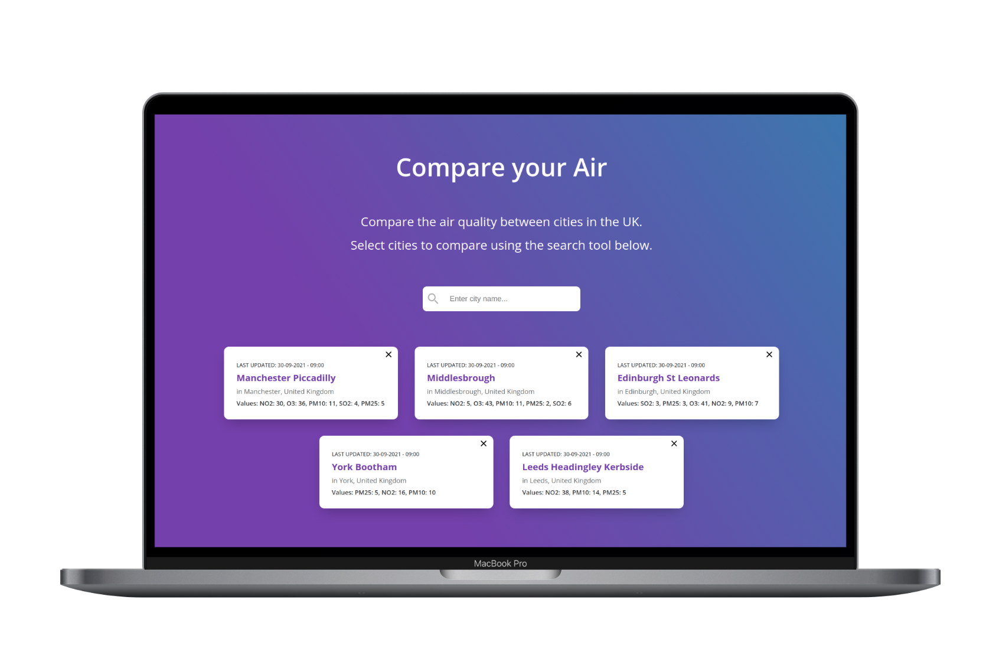
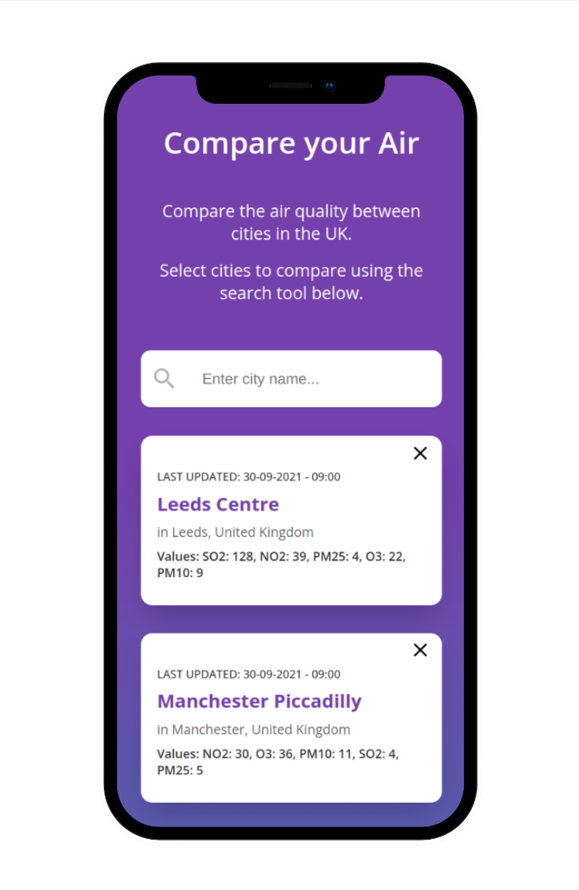

## Air Quality App 🍃

An Air Quality App which allows users to compare air quality across cities in the UK using the Open AQ Air Quality API.

## Previews:

## Built Using:

- React
- HTML
- CSS
- SCSS
- JavaScript
- Node.js
- APIs

## Tested Using:

- Jest
- React Testing Library

## NPM Packages used:

- Axios
- PropTypes

---

### In the project directory, you can run:

`npm start`

Runs the app in the development mode. 
Open [http://localhost:3000](http://localhost:3000) to view it in the browser.

The page will reload if you make edits. 
You will also see any lint errors in the console.

`npm test`

Launches the test runner in the interactive watch mode. 
See the section about [running tests](https://facebook.github.io/create-react-app/docs/running-tests) for more information.

## By [Ellie Kemp](https://github.com/erkemp3) 🙋‍♀️
